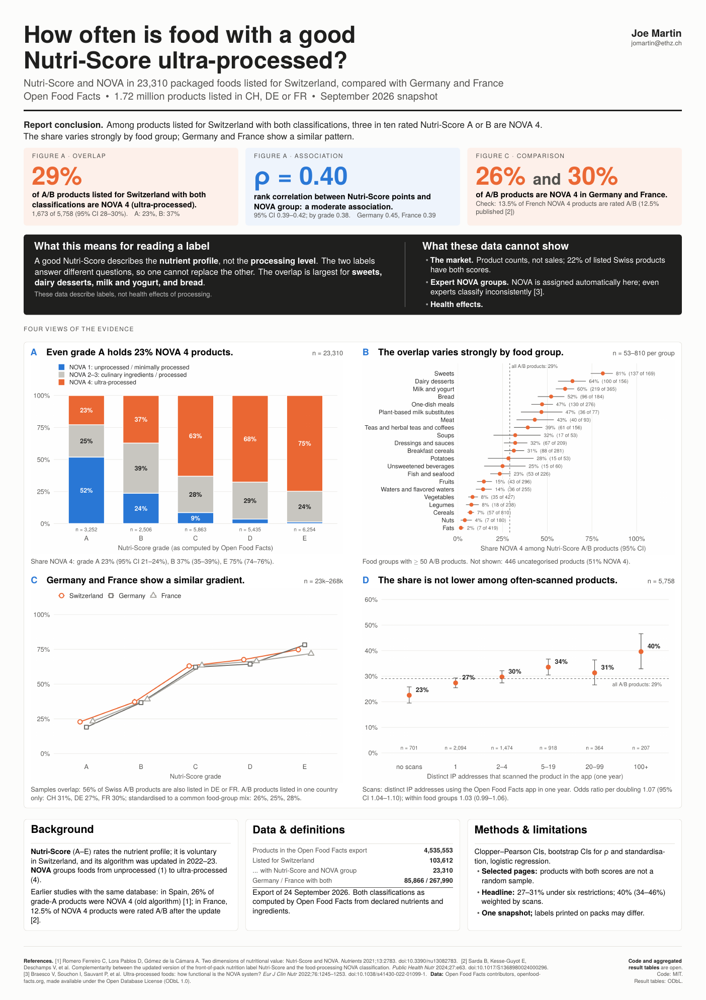
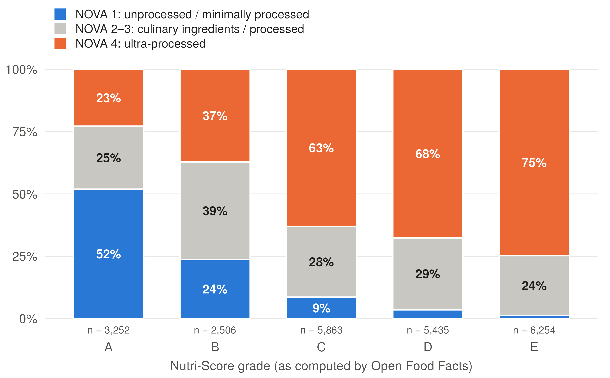
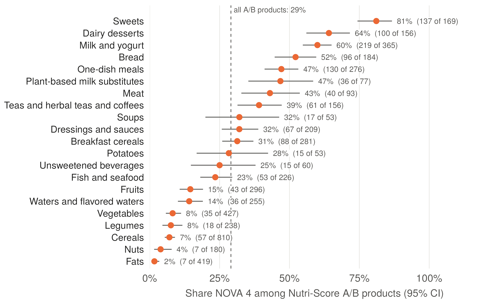
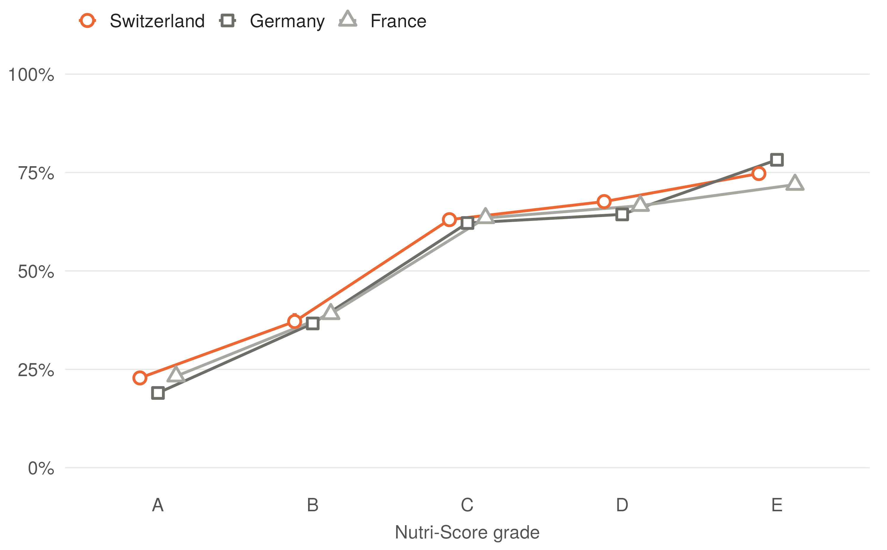
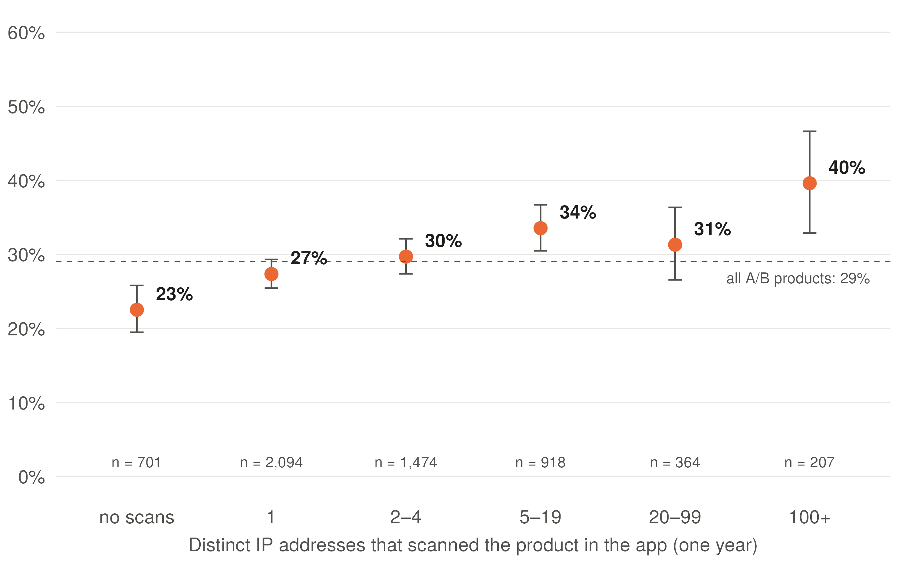

# How often is food with a good Nutri-Score ultra-processed?

**Nutri-Score and NOVA processing groups in 23,310 packaged foods listed for Switzerland, compared with Germany and France (Open Food Facts, September 2026)**

Joe Martin · BSc Food Science & Technology, ETH Zurich · jomartin@ethz.ch



---

## Summary

Nutri-Score (A–E) rates a product's nutrient profile. NOVA groups foods by how much they are processed, from unprocessed (1) to ultra-processed (4). The two are often confused on the shelf, but they measure different things. This project asks how often a favourable Nutri-Score and ultra-processing coincide in products sold in Switzerland, using the full public Open Food Facts database.

**Findings**

1. **29% of the A/B products listed for Switzerland with both classifications available are NOVA 4** (1,673 of 5,758; 95% CI 28–30%). The confidence interval covers sampling error only, not selection bias or classification errors. Grade A: 23%, grade B: 37%, grade E: 75%.
2. **The two systems are only moderately associated.** Spearman ρ between Nutri-Score points and NOVA group is 0.40 (bootstrap 95% CI 0.39–0.42); 0.38 when using grades A–E instead of points.
3. **The overlap of A/B and NOVA 4 varies strongly by food group:** 81% of A/B sweets, 64% of dairy desserts, 60% of milk and yogurt and 52% of bread are NOVA 4, against 2–8% of fats, nuts, cereals, legumes and vegetables.
4. **Germany and France show a similar pattern:** 26% and 30% of A/B products are NOVA 4. The samples overlap (56% of Swiss A/B products are also listed in DE or FR); products listed in one country only give CH 31%, DE 27%, FR 30%.
5. **The share is not lower among often-scanned products.** A/B products scanned from more IP addresses are, if anything, more often NOVA 4 (odds ratio 1.07 per doubling of scans, 95% CI 1.04–1.10); within food groups the trend is uncertain (1.03, 0.99–1.06).

**External check.** Sarda et al. (2024) used the same database for products sold in France and found that 12.5% of NOVA 4 products were rated A or B under the updated Nutri-Score. This pipeline gives 13.5% for France, from a later snapshot.

**What this means.** A good Nutri-Score says the nutrient profile is favourable; it does not say the product is minimally processed. The two labels answer different questions. These data describe labels, not health effects of processing.

---

## Figures

| | |
|---|---|
|  |  |
| **A** NOVA composition of each Nutri-Score grade (CH, n = 23,310) | **B** Share NOVA 4 among A/B products by food group (CH, groups with ≥ 50 A/B products) |
|  |  |
| **C** Share NOVA 4 by grade in CH, DE and FR | **D** Share NOVA 4 among CH A/B products by number of IP addresses that scanned them in the app |

Colours: orange always means "share NOVA 4".

---

## Data

**Source.** Open Food Facts full CSV export (`en.openfoodfacts.org.products.csv.gz`), downloaded 24 September 2026, 4,535,553 products. Open Food Facts is a crowd-sourced database of packaged foods. Its data are published under the **Open Database License (ODbL 1.0)**.

**Filtering.** `scripts/filter_off.sh` keeps products whose `countries_tags` include Switzerland, Germany or France (1,723,191 rows) and 25 columns: identifiers, category and country tags, Nutri-Score, NOVA group, scan count, completeness and nutrients per 100 g. It takes about a minute on a laptop.

| | CH | DE | FR |
|---|---|---|---|
| Products listed as sold in the country | 103,612 | 408,726 | 1,263,828 |
| ... with a Nutri-Score grade A–E | 42,226 | 119,407 | 476,357 |
| ... with a NOVA group | 31,433 | 109,883 | 345,589 |
| ... with both (analysis sample) | **23,310** (22%) | **85,866** (21%) | **267,990** (21%) |

**Definitions**

| Term | Definition |
|---|---|
| Sold in a country | Product carries the exact tag `en:switzerland`, `en:germany` or `en:france` in `countries_tags` (set by contributors). A product can be listed in several countries and then counts in each |
| Nutri-Score grade | As computed by Open Food Facts from the declared nutrients, using the updated algorithm (Open Food Facts switched to it in December 2024). Grades `unknown` and `not-applicable` are excluded |
| NOVA group | As computed by Open Food Facts from the ingredient list and categories (marked as experimental by Open Food Facts) |
| Overlap | Nutri-Score A or B **and** NOVA 4. The two systems measure different attributes, so this is not a contradiction |
| Food group | Open Food Facts PNNS group 2 (`pnns_groups_2`); `unknown` is reported as "Uncategorised" |
| Scans | `unique_scans_n`: number of distinct IP addresses that scanned the product with the official Open Food Facts apps in one calendar year, computed by Open Food Facts from server logs (`scripts/scanbot.pl` in the openfoodfacts-server repository). A rough proxy for how often a product is looked up, not for sales or verified users |

One record per barcode (27 duplicates removed, keeping the most recently modified).

---

## Methods

All analyses are in `R/Food_Analysis.R` (R ≥ 4.1, `data.table`, `ggplot2`; `ragg` and `systemfonts` optional for the poster font). The script writes aggregated result tables to `results/`.

- **Proportions** with exact Clopper–Pearson 95% CIs.
- **Association** between the systems: Spearman ρ between Nutri-Score points and NOVA group, 95% CI from 2,000 bootstrap resamples of products. Checked with grades A–E instead of points, because points are on different scales for beverages, fats and cheese.
- **Country comparison:** share NOVA 4 by grade per country. Share NOVA 4 among A/B products (a) crude, (b) for products listed in one country only, and (c) directly standardised to a common food-group mix (32 PNNS groups with ≥ 10 A/B products in every country, weights = pooled A/B products, uncategorised excluded; CI from 1,000 bootstrap resamples within food groups).
- **Scan gradient:** logistic regression of NOVA 4 on log₂(scans) among scanned A/B products in Switzerland (n = 5,057), crude and adjusted for food group.
- **Sensitivity of the headline** (share NOVA 4 among Swiss A/B products): excluding uncategorised products, implausible nutrient values (outside 0–100 g/100 g, sugars > carbohydrates, saturated > total fat, energy > 900 kcal), pages with completeness < 0.8, products also listed in DE/FR, beverages, artificially sweetened beverages; and weighting by scans.

---

## Results

**Share NOVA 4 by Nutri-Score grade (CH)**

| Grade | n | NOVA 4 | Share (95% CI) |
|---|---|---|---|
| A | 3,252 | 742 | 23% (21–24) |
| B | 2,506 | 931 | 37% (35–39) |
| C | 5,863 | 3,695 | 63% (62–64) |
| D | 5,435 | 3,675 | 68% (66–69) |
| E | 6,254 | 4,674 | 75% (74–76) |

**Country comparison (A/B products)**

| | CH | DE | FR |
|---|---|---|---|
| A/B products | 5,758 | 21,312 | 69,745 |
| Share NOVA 4, crude | 29% (28–30) | 26% (25–26) | 30% (30–30) |
| ... listed in this country only | 31% (29–33) | 27% (26–27) | 30% (30–31) |
| ... standardised to a common food-group mix | 26% (24–27) | 25% (25–26) | 28% (28–29) |
| Share of NOVA 4 products rated A/B | 12% (12–13) | 11% (11–11) | 14% (13–14) |
| Spearman ρ (points vs. NOVA) | 0.40 | 0.45 | 0.39 |

**Sensitivity of the Swiss headline (29%)**

| Analysis | A/B products | Share NOVA 4 (95% CI) |
|---|---|---|
| Main analysis | 5,758 | 29% (28–30) |
| Excluding uncategorised products | 5,312 | 27% (26–28) |
| Excluding implausible nutrient values | 5,742 | 29% (28–30) |
| Completeness ≥ 0.8 | 2,330 | 30% (28–32) |
| Listed in CH only | 2,560 | 31% (29–33) |
| Foods only (no beverages) | 5,122 | 29% (28–30) |
| Excluding artificially sweetened beverages | 5,746 | 29% (28–30) |
| Weighted by scans | 5,057 | 40% (34–46) |

The six restrictions move the headline between 27% and 31%. Weighting by scans gives 40% (34–46%); because scans are IP-based lookups in one year, this does not establish what share of purchased products is affected.

Full tables: `results/`.

---

## Limitations

- **Not the market.** Open Food Facts counts products that volunteers entered, not products sold or eaten. Only about 22% of listed products have both scores, and complete pages are not a random sample.
- **NOVA is assigned automatically** from ingredient lists, which Open Food Facts itself describes as experimental. NOVA is also contested as a system: food experts assign NOVA groups inconsistently (Fleiss κ 0.32–0.34; Braesco et al. 2022).
- **Nutri-Score as computed, not as printed.** The grade here uses the updated algorithm. The label on the pack (if any) may still show the old grade during the transition, and many Swiss products carry no Nutri-Score at all.
- **Computed grades can be wrong.** 12 artificially sweetened drinks (e.g. diet colas) are rated B, although the updated algorithm penalises sweeteners in beverages; the sweeteners were probably not recognised in the ingredient lists. They are listed in `results/audit_sweetened_beverages_ab.csv`; excluding them changes the headline from 29.1% to 28.9%. Similar errors may exist in other categories.
- **Overlapping samples.** Products listed in several countries count in each; the country comparison is therefore not a set of independent replications.
- **Country tags.** A few products carry non-standard country tags (e.g. `en:suisse` instead of `en:switzerland`) and are not counted.
- **One snapshot** (24 September 2026); no time trends.
- **No health claims.** Whether processing affects health beyond nutrient content is outside the scope of these data.

---

## Reproducibility

```
.
├── README.md
├── R/Food_Analysis.R        # full analysis: tables, checks, figures
├── scripts/filter_off.sh    # reduces the 1.3 GB export to CH/DE/FR and 25 columns
├── figures/                 # poster figures, 300 dpi
├── results/                 # aggregated result tables (ODbL)
├── poster/                  # A1 poster (XeLaTeX source and PDF)
├── fonts/                   # TeX Gyre Heros (free Helvetica clone), GUST Font License
└── data/                    # input goes here (not committed; see below)
```

1. Download https://static.openfoodfacts.org/data/en.openfoodfacts.org.products.csv.gz
2. `bash scripts/filter_off.sh path/to/en.openfoodfacts.org.products.csv.gz`
3. `Rscript R/Food_Analysis.R` (from the repository root; about 2–3 minutes)
4. Poster: `cd poster && xelatex Poster_NutriScore_NOVA_A1.tex` (twice)

A newer export gives slightly different numbers, because the database changes daily. For exact reproduction, use the archived input: `data/off_ch_de_fr_subset.tsv.gz` (82 MB, SHA-256 in `results/input_manifest.csv`; to be archived on Zenodo together with this repository, since the ODbL allows redistribution with attribution under the same licence). R and package versions are in `results/session_info.txt`; all bootstrap steps use a fixed seed.

---

## References

1. Romero Ferreiro C, Lora Pablos D, Gómez de la Cámara A. Two dimensions of nutritional value: Nutri-Score and NOVA. *Nutrients* 2021;13:2783. [doi:10.3390/nu13082783](https://doi.org/10.3390/nu13082783)
2. Sarda B, Kesse-Guyot E, Deschamps V, et al. Complementarity between the updated version of the front-of-pack nutrition label Nutri-Score and the food-processing NOVA classification. *Public Health Nutrition* 2024;27:e63. [doi:10.1017/S1368980024000296](https://doi.org/10.1017/S1368980024000296)
3. Braesco V, Souchon I, Sauvant P, et al. Ultra-processed foods: how functional is the NOVA system? *European Journal of Clinical Nutrition* 2022;76:1245–1253. [doi:10.1038/s41430-022-01099-1](https://doi.org/10.1038/s41430-022-01099-1)
4. Open Food Facts. Nova groups for food processing. [world.openfoodfacts.org/nova](https://world.openfoodfacts.org/nova)
5. Open Food Facts. Open Food Facts computes the new Nutri-Score on 3 million products (17 December 2024). [blog.openfoodfacts.org](https://blog.openfoodfacts.org/en/news/open-food-facts-computes-the-new-nutri-score-on-3-million-products)

---

## Authorship

Research question, analysis decisions and interpretation: Joe Martin. Code, poster layout and text were drafted with the help of an AI assistant (Claude, Anthropic) and checked, revised and run by the author. All numbers come from the scripts in this repository.

---

## Licence

- **Code** (`R/`, `scripts/`): MIT, see `LICENSE`.
- **Result tables** (`results/`): derived from Open Food Facts and published under the Open Database License (ODbL 1.0).
- **Figures, poster and text**: CC BY 4.0. They contain information from Open Food Facts, which is made available under the ODbL.
- **Data**: © Open Food Facts contributors, [openfoodfacts.org](https://world.openfoodfacts.org), ODbL 1.0. Not redistributed here; see Reproducibility.
